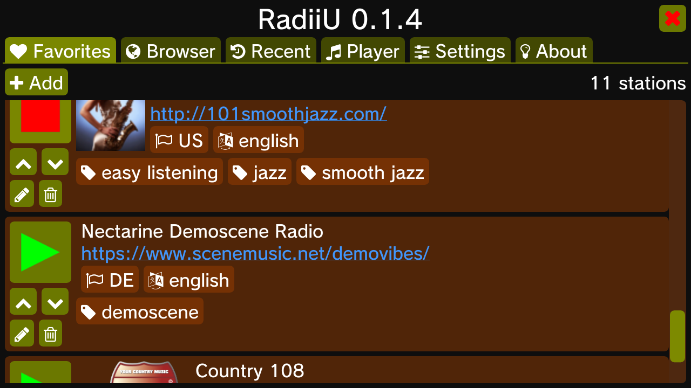

# RadiiU

<p align="center">
    <a href="https://hb-app.store/wiiu/RadiiU">
        
    </a>
</p>

This is an internet radio player app for the Wii U.

It uses the station listing from [www.radio-browser.info](https://www.radio-browser.info).




## Build instructions

### Dependencies

- freetype2

- jansson

- libcurl

- libmpg123

- libopusfile

- libvorbisfile

- SDL2, SDL2_image, SDL2_ttf
  - Note: a fork of SDL2 with swkbd support is required:
    https://github.com/dkosmari/SDL/tree/wiiu-sdl2-devel


### Obtaining the source

- Via mercurial:
  - `hg clone https://github.com/dkosmari/RadiiU.git`

- Via git:
  - `git clone --recurse-submodules --shallow-submodules https://github.com/dkosmari/RadiiU.git`

After checking out the code, run:

```
./bootstrap
```

(This needs to only be done once, to create the `configure` script.)


### Wii U build

```
./configure --enable-wiiu --host=powerpc-eabi
make
```

If the Wii U is named `wiiu` in your local network, you can run:

- `make run`
  - This will use `wiiload` to run it on the Wii U without installing.

- `make install-wiiu`
  - This will install `radiiu.wuhb`, via ftp.

- `make uninstall-wiiu`
  - This will uninstall `radiiu.wuhb`, via ftp.

### Native build

This has only been tested on GNU/Linux environments so far.

```
./configure
make
make run
```

Note that the native build is meant to be run from the source code directory. It requires
a file named `CafeStd.ttf`, to be used as the main font.
